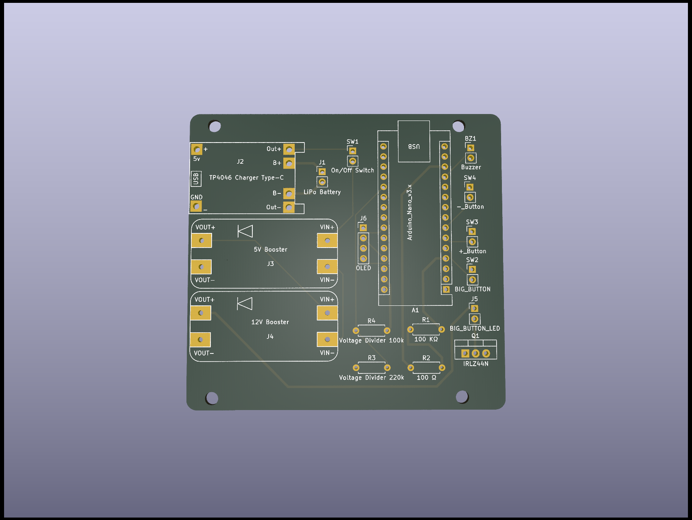
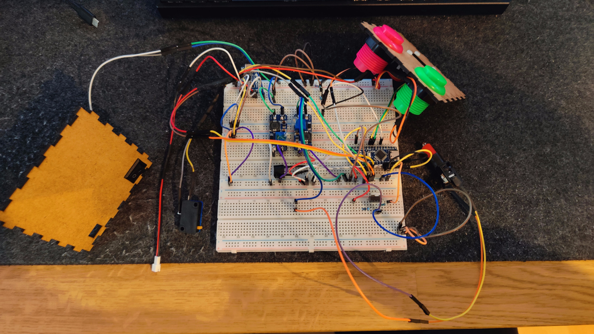

# Rummikub Timer

This project is a Rummikub timer. It has the following functions:

- Set a countdown time (default: 1 minute)
- Start timer by pressing big button
- Reset and start timer by pressing it again
- Blink big button when reaching 10 second time zone
- Alarm if time is up
- Nice laser-cut enclosure
- Runs on battery
- Chargable via USB-C
- Incorporates a display

## Hardware

The project consists of the following components:

- Arduino Nano
- LiPo Battery
- TP4056 USB-C charging 
- Different push buttons (28mm, 100mm with LED)
- On/Off Switch
- Active Buzzer
- MT3608 Step-Up Converter
- 0,96" OLED Display
- Small components like resistors and a mosfet

## Images

## Lessons learned

The box is really tight, so I had to improvise and cut away from some of the buttons. Also The top button is not fixed into casing as it is to tight. But that in fact is better, so you can assamble and then maintaine it, by just pulling the big button out. As the button will be pushed it is not a problem it is not fixed anyways.

## Hazard warning

If you build it like I did never run and charge at the same time. The missing safe charge circuit during load is not sharing the load, so the battery will be over-charged and might caught on fire. I DO NOT HOLD ACCOUNTABILITY FOR DAMAGE TO YOU OR YOUR SURROUNDINGS.
